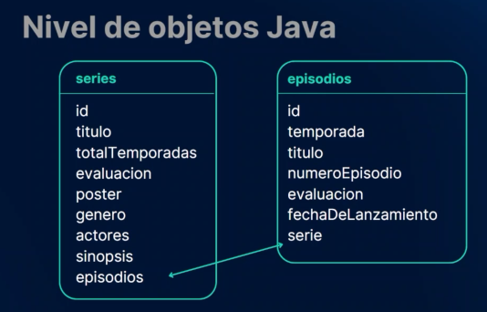
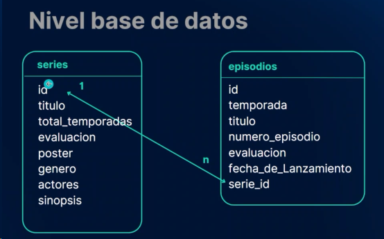

# ScreenMatch

Proyecto desarrollado durante el segundo curso de la formación Avanzando con Java de Alura

## 🔨 Objetivos del proyecto

* Avanzar en el proyecto Screenmatch, iniciado en el primer curso de la formación, creando un menú con varias opciones;
* Modelar las abstracciones de la aplicación a través de clases, enums, atributos y métodos;
* Consumir la API del ChatGPT(Opcional;
* Utilizar Spring Data JPA para persistir datos en la base de datos;
* Conocer varios tipos de bases de datos y utilizar PostgreSQL;
* Trabajar con varios tipos de consultas a la base de datos;
* Profundizar en la interfaz JPA Repository.

----------------------------------------------------------------

### Progreso del curso by sanchezluys

| Clase | Descripción                                                                                                    | Estado                                                                                                           |
|-------|----------------------------------------------------------------------------------------------------------------|------------------------------------------------------------------------------------------------------------------|
| 01-03 | Avanzando con nuestra aplicación Java                                                                          |                                                                                                                  |
|       | - Se crea la opcion listado de series buscadas                                                                 |                                                                                                                  |
|       | - Se crea el metodo mostrarSeriesBuscadas()                                                                    |                                                                                                                  |
|       |                                                                                                                |                                                                                                                  |
| 01-06 | Modelando categorías y series                                                                                  |                                                                                                                  |
|       | Se crea la clase Series                                                                                        |                                                                                                                  |
|       | Se crea un enum Categoria                                                                                      |                                                                                                                  |
|       | Se crean los enum Accion, Romance etc                                                                          |                                                                                                                  |
|       | Se hace el constructor para las categorias                                                                     |                                                                                                                  |
|       | Uso de CTRL + F para reemplazar rapido un texto                                                                |                                                                                                                  |
|       | =>Menu ->Edit->Find->Find...                                                                                   |                                                                                                                  |
|       |                                                                                                                |                                                                                                                  |
| 01-09 | Utilizando la clase más completa                                                                               |                                                                                                                  |
|       | Se crea el constructor para Serie                                                                              |                                                                                                                  |
|       | Se usa optional para evaluacion                                                                                |                                                                                                                  |
|       |                                                                                                                |                                                                                                                  |
| 01-10 | Terminando la adaptación para la clase Serie                                                                   |                                                                                                                  |
|       | Se modifica el metodo mostrarSeriesBuscadas                                                                    |                                                                                                                  |
|       | usando stream()                                                                                                |                                                                                                                  |
|       |                                                                                                                |                                                                                                                  |
| 01-13 | Usando ChatGPT para traducir la sinopsis                                                                       |                                                                                                                  |
|       | Se crea un nuevo modelo en el paquete service                                                                  | falla, sin creditos en chatgpt                                                                                   |
|       | se llama ConsultaChatGPT                                                                                       |                                                                                                                  |
|       | Se agrega el codigo indicado en la clase                                                                       |                                                                                                                  |
|       | Se agrega la dependencia en el archivo pom.xml                                                                 |                                                                                                                  |
|       | esta: com.theokanning.openai-gpt3-java                                                                         |                                                                                                                  |
|       | ~~Se agrega la dependencia en pom.xml del archivo .env~~                                                       | da error                                                                                                         |
|       | ~~io.github.cdimascio~~                                                                                        | da error                                                                                                         |
|       | Se usan las variables de entorno de intellij para protejer                                                     |                                                                                                                  |
|       | las llaves de imdb y chat gpt                                                                                  |                                                                                                                  |
|       | Ejemplo:  String clave2 = System.getenv("API_KEY");                                                            |                                                                                                                  |
|       | String clave = System.getenv("CHAT_GPT");                                                                      |                                                                                                                  |
|       | Se agrega la traduccion por chatgpt                                                                            |                                                                                                                  |
|       | this.sinopsis = ConsultaChatGPT.obtenerTraduccion(datosSerie.sinopsis())                                       |                                                                                                                  |
|       | Se  desactiva la traduccion chtgpt ya que no tengo creditos.                                                   |                                                                                                                  |
|       |                                                                                                                |                                                                                                                  |
| 02-03 | Creando una base de datos relacional                                                                           |                                                                                                                  |
|       | En mi caso uso bd postresql alojada en un servicio gratuito en neon.tech                                       |                                                                                                                  |
|       | Se usa https://start.spring.io/                                                                                |                                                                                                                  |
|       | Para instalara Spring Data JPA                                                                                 |                                                                                                                  |
|       | tambien el driver de postgresql                                                                                |                                                                                                                  |
|       | Se agregan las dependencias de JPA y el Driver de postgresq en el pom.xml del proyecto                         |                                                                                                                  |
|       |                                                                                                                |                                                                                                                  |
| 02-05 | Conectando a la base de datos                                                                                  |                                                                                                                  |
|       | Se crea la bd, Java_Screenmatch con PgAdmin                                                                    |                                                                                                                  |
|       | Se configura el archivo de configuracion con las credenciales                                                  |                                                                                                                  |
|       | Se usa la API de omdb con variables de configuracion de la aplicacion por seguridad                            |                                                                                                                  |
|       | Se agrega en applicatio.property: hibernate.dialect=org.hibernate.dialect.HSQLDialect                          |                                                                                                                  |
|       |                                                                                                                |                                                                                                                  |
| 02-08 | Mapeando las entidades                                                                                         |                                                                                                                  |
|       | Se trabaja en la clase serie                                                                                   |                                                                                                                  |
|       | Se agrega antes de la definicion: @Entity   y @Table(name = "series")                                          |                                                                                                                  |
|       | Se crea dentro de la clase el id: private Long Id;                                                             |                                                                                                                  |
|       | Antes de la id se crea: @Id con import jakarta.persistence.Id;                                                 |                                                                                                                  |
|       | Se define la estrategia: @GeneratedValue(strategy = GenerationType.IDENTITY)                                   |                                                                                                                  |
|       | Como se quiere que el nombre de la serie sea unico se usa:  @Column(unique = true)                             |                                                                                                                  |
|       | - antes de la definicion de la variable titulo                                                                 |                                                                                                                  |
|       | Tambien se le debe decir a JPA que datos son enum                                                              |                                                                                                                  |
|       | - el caso genero es enum: entonces antes de la declaracion se agrega:                                          |                                                                                                                  |
|       | - @Enumerated(EnumType.STRING)                                                                                 |                                                                                                                  |
|       | luego generar los getters y setters del Id                                                                     |                                                                                                                  |
|       | Se agrega en application.property: spring.jpa.hibernate.ddl-auto=update                                        |                                                                                                                  |
|       | - para que se actualice la bd al existir cambios, jpa guarda las columnas con snake_cas                        |                                                                                                                  |
|       | - de manera alfabetica el solo toma esas decisiones                                                            |                                                                                                                  |
|       |                                                                                                                |                                                                                                                  |
| 02-11 | Guardando informaciones en la base de datos                                                                    |                                                                                                                  |
|       | Se agrega a serie private List<Episodio> episodios; que es la,lista de episodios                               |                                                                                                                  |
|       | con el mapeo @Transient que le dice a JPA que no tome en cuenta las relaciones en la bd                        |                                                                                                                  |
|       | * Se crea el paquete repository                                                                                |                                                                                                                  |
|       | * se agrega la interface SerieRepository ese nombre por convencion                                             |                                                                                                                  |
|       | * esa interface extiende de JpaRepository y debe contener la serie y el tipo de id (Serie, Long)               |                                                                                                                  |
|       | * No se puede instanciar de manera directa la interface, se usa inyeccion de dependencias.                     |                                                                                                                  |
|       | ** se hace con la anotacion @Autowired ** en la clase que dependa de spring ojo.                               |                                                                                                                  |
|       | para este caso la clase que depende de spring es ScreenmatchApplication                                        |                                                                                                                  |
|       | y alli mismo se instancia *private SerieRepository repository;*                                                |                                                                                                                  |
|       | se envia al constructor de la clase principal, creando ese constructor                                         |                                                                                                                  |
|       | en el constructor se agrega en la clase el atributo private SerieRepository repo; por ejemplo                  |                                                                                                                  |
|       | y se asigna al repository que viene del constructor                                                            |                                                                                                                  |
|       |                                                                                                                |                                                                                                                  |
|       | Para guardar los datos en la bd                                                                                |                                                                                                                  |
|       | cuando se hace la busqueda con la api                                                                          |                                                                                                                  |
|       | 1. se crea el dato tipo serie, Serie serie = new  Serie(datos);                                                |                                                                                                                  |
|       | 2. se guarda llamando a repo.save(serie);                                                                      |                                                                                                                  |
|       | - aun con error: no guarda el dato: at jdk.proxy2/jdk.proxy2.$Proxy90.persist(Unknown Source) ~[na:na]         | El error es que las anotaciones deben estar en orden                                                             |
|       |                                                                                                                | antes de crear el private Long Id, debes estar:                                                                  |
|       |                                                                                                                | @Id                                                                                                              |
|       |                                                                                                                | @GeneratedValue(strategy = GenerationType.IDENTITY)                                                              |
|       |                                                                                                                | private Long Id;                                                                                                 |
| 02-13 | Dejando los datos sensibles seguros                                                                            |                                                                                                                  |
|       | Documentacion oficial: https://docs.spring.io/spring-data/jpa/reference/repositories/core-concepts.html        |                                                                                                                  |
|       | Se actualiza el metodo mostrarSeriesBuscadas en principal. ahora con jpa                                       | Se debe crear un constructor predeterminado                                                                      |
|       | Se debe crear siempre un constructor predeterminado por exigencia de JPA                                       | internamente antes del constructor personalizado:                                                                |
|       |                                                                                                                | public Serie(){}                                                                                                 |
|       | Buenas practicas para proteger los datos                                                                       |                                                                                                                  |
|       | Se crean las variables de entorno en el sistema operativo                                                      |                                                                                                                  |
|       | Luego en el application.properties se agregan con ${nombre_variable_entorno}                                   |                                                                                                                  |
|       |                                                                                                                |                                                                                                                  |
| 03-02 | Relacionando series y episodios                                                                                |                                                                                                                  |
|       | En la clase episodio se crea un nuevo atributo: private Serie serie;                                           |                                                                                                                  |
|       | Se agregan los setter y getters                                                                                |                                                                                                                  |
|       | ya se puede eliminar la anotacion @Transient en la clase serie, para activar la relacion                       |                                                                                                                  |
|       | Se mapea con  @OneToMany(mappedBy = "serie", cascade = CascadeType.ALL, fetch = FetchType.LAZY) en clase serie |                                                                                                                  |
|       |                                                                                                                |                                                                                                                  |
|       | **Episodio se debe convertir en una entidad**                                                                  |                                                                                                                  |
|       | @Entity     @Table(name = "episodios")                                                                         |                                                                                                                  |
|       | @Id   @GeneratedValue(strategy = GenerationType.IDENTITY)  private Long Id;                                    |                                                                                                                  |
|       | @ManyToOne(fetch = FetchType.LAZY)   @JoinColumn(name = "serie_id")                                            |                                                                                                                  |
|       | y el constructor predeterminado: public Episodio(){}                                                           |                                                                                                                  |
|       |                                                                                                                |                                                                                                                  |
| 03-04 | Profundizando en las relaciones bidireccionales                                                                |                                                                                                                  |
|       | Se crea una variable global con la lista de series disponible en la BD  private List<Serie> series;            |                                                                                                                  |
|       | Se usa optional, se muestra el listado de series disponibles en la bd                                          |                                                                                                                  |
|       | Se pide el nombre de la serie para buscar sus episodios                                                        |                                                                                                                  |
|       | Se valida y se traen los episodios, se usa stream(), se guardan en la BD                                       |                                                                                                                  |
|       |                                                                                                                |                                                                                                                  |
|       | Se agregan esas opciones al application.properties                                                             | Activa los logs para ver que sucede                                                                              |
|       | spring.jpa.show-sql=true                                                                                       |                                                                                                                  |
|       | spring.jpa.format-sql=true                                                                                     |                                                                                                                  |
|       |                                                                                                                |                                                                                                                  |
| 03-07 | Guardando episodios de la serie                                                                                |                                                                                                                  |
|       | Cuando haya un cambio en episodios entonces deberia haber un cambio en series y visceversa                     | Ya guarda en episodios pero no relaciona con las serie                                                           |
|       | @OneToMany(mappedBy = "serie", cascade = CascadeType.ALL)                                                      | en serie_id                                                                                                      |
|       |                                                                                                                |                                                                                                                  |
| 03-09 | Ajustando la llave foránea                                                                                     |                                                                                                                  |
|       | Se debe ajustar setEpisodios en la clase serie: episodios.forEach(e->e.setSerie(this));                        |                                                                                                                  |
|       | Luego se agrega al toString() de serie los episodios: ", episodios='" + episodios + '\''                       | da error: Caused by: org.hibernate.LazyInitializationException: failed to lazily initialize a collection of role |
|       | Existen 2 formas de traer los datos: de forma perezosa (LAZY) y de forma ansiosa (EAGER)                       |                                                                                                                  |
|       | @OneToMany(mappedBy = "serie", cascade = CascadeType.ALL, fetch = FetchType.EAGER)                             |                                                                                                                  |
|       |                                                                                                                |                                                                                                                  |
| 04-02 | Búsquedas por partes del título                                                                                |                                                                                                                  |
|       | Se agrega en el menu la opcion 4 de buscar series por titulo, en principal                                     |                                                                                                                  |
|       | Se arregla serieRepository                                                                                     |                                                                                                                  |
|       | agregando esta busqueda:  Optional<Serie> findByTituloContainsIgnoreCase(String nombreSerie);                  |                                                                                                                  |
|       | se aplica la logica y se muestra si existe o no la serie buscada por titulo en la bd                           |                                                                                                                  |
|       | apoyarse con: https://docs.spring.io/spring-data/jpa/reference/jpa/query-methods.html                          |                                                                                                                  |
|       |                                                                                                                |                                                                                                                  |
| 04-05 | Buscando top 5 series                                                                                          |                                                                                                                  |
|       | se agrega una nueva **derived query** en serieRepository  para buscar el top5                                  |                                                                                                                  |
|       | List<Serie> findTop5ByOrderByEvaluacionDesc();                                                                 |                                                                                                                  |
|       | Se agrega la nueva opcion de top 5 en el menu :                                                                |                                                                                                                  |
|       |                                                                                                                |                                                                                                                  |
| 04-06 | Búsquedas por categorías                                                                                       |                                                                                                                  |
|       | Se agrega al menu la opcion 6 buscar series por categoria                                                      |                                                                                                                  |
|       | Al pedir al usuario la categoria a buscar es necesario hacer conversion enum con categoria                     |                                                                                                                  |
|       | En el enum Categoria es necesario agregar las opciones en español y agregarlas a constructor                   |                                                                                                                  |
|       | Se debe tambien agregar el metodo nuevo con espanol                                                            |                                                                                                                  |
|       |                                                                                                                |                                                                                                                  |

### relacion series con episodios:

