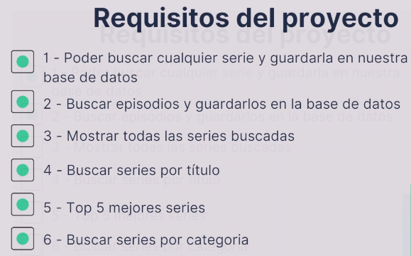
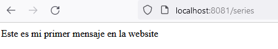
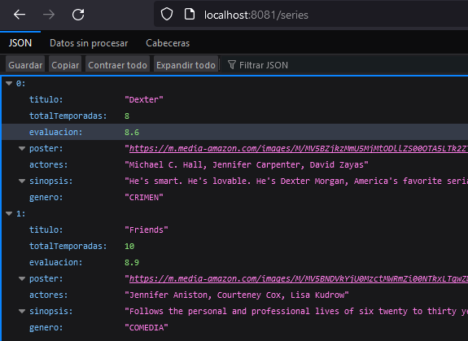

# ScreenMatch

Proyecto desarrollado durante el segundo curso de la formación Avanzando con Java de Alura

## 🔨 Objetivos del proyecto

* Avanzar en el proyecto Screenmatch, iniciado en el primer curso de la formación, creando un menú con varias opciones;
* Modelar las abstracciones de la aplicación a través de clases, enums, atributos y métodos;
* Consumir la API del ChatGPT(Opcional;
* Utilizar Spring Data JPA para persistir datos en la base de datos;
* Conocer varios tipos de bases de datos y utilizar PostgreSQL;
* Trabajar con varios tipos de consultas a la base de datos;
* Profundizar en la interfaz JPA Repository.

----------------------------------------------------------------

### Progreso del curso by sanchezluys

| Clase | Descripción                                                                            | Estado                         |
|-------|----------------------------------------------------------------------------------------|--------------------------------|
| 01-03 | Avanzando con nuestra aplicación Java                                                  |                                |
|       | - Se crea la opcion listado de series buscadas                                         |                                |
|       | - Se crea el metodo mostrarSeriesBuscadas()                                            |                                |
|       |                                                                                        |                                |
| 01-06 | Modelando categorías y series                                                          |                                |
|       | Se crea la clase Series                                                                |                                |
|       | Se crea un enum Categoria                                                              |                                |
|       | Se crean los enum Accion, Romance etc                                                  |                                |
|       | Se hace el constructor para las categorias                                             |                                |
|       | Uso de CTRL + F para reemplazar rapido un texto                                        |                                |
|       | =>Menu ->Edit->Find->Find...                                                           |                                |
|       |                                                                                        |                                |
| 01-09 | Utilizando la clase más completa                                                       |                                |
|       | Se crea el constructor para Serie                                                      |                                |
|       | Se usa optional para evaluacion                                                        |                                |
|       |                                                                                        |                                |
| 01-10 | Terminando la adaptación para la clase Serie                                           |                                |
|       | Se modifica el metodo mostrarSeriesBuscadas                                            |                                |
|       | usando stream()                                                                        |                                |
|       |                                                                                        |                                |
| 01-13 | Usando ChatGPT para traducir la sinopsis                                               |                                |
|       | Se crea un nuevo modelo en el paquete service                                          | falla, sin creditos en chatgpt |
|       | se llama ConsultaChatGPT                                                               |                                |
|       | Se agrega el codigo indicado en la clase                                               |                                |
|       | Se agrega la dependencia en el archivo pom.xml                                         |                                |
|       | esta: com.theokanning.openai-gpt3-java                                                 |                                |
|       | ~~Se agrega la dependencia en pom.xml del archivo .env~~                               | da error                       |
|       | ~~io.github.cdimascio~~                                                                | da error                       |
|       | Se usan las variables de entorno de intellij para protejer                             |                                |
|       | las llaves de imdb y chat gpt                                                          |                                |
|       | Ejemplo:  String clave2 = System.getenv("API_KEY");                                    |                                |
|       | String clave = System.getenv("CHAT_GPT");                                              |                                |
|       | Se agrega la traduccion por chatgpt                                                    |                                |
|       | this.sinopsis = ConsultaChatGPT.obtenerTraduccion(datosSerie.sinopsis())               |                                |
|       | Se  desactiva la traduccion chtgpt ya que no tengo creditos.                           |                                |
|       |                                                                                        |                                |
| 02-03 | Creando una base de datos relacional                                                   |                                |
|       | En mi caso uso bd postresql alojada en un servicio gratuito en neon.tech               |                                |
|       | Se usa https://start.spring.io/                                                        |                                |
|       | Para instalara Spring Data JPA                                                         |                                |
|       | tambien el driver de postgresql                                                        |                                |
|       | Se agregan las dependencias de JPA y el Driver de postgresq en el pom.xml del proyecto |                                |
|       |                                                                                        |                                |
| 02-05 | Conectando a la base de datos                                                          |                                |
|       | Se crea la bd, Java_Screenmatch con PgAdmin                                            |                                |
|       |                                                                                        |                                |
|       |                                                                                        |                                |
|       |                                                                                        |                                |
|       |                                                                                        |                                |
|       |                                                                                        |                                |

