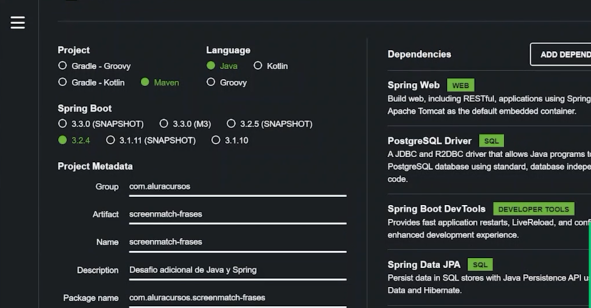

# ScreenMatch - WEB - RETO

Proyecto desarrollado durante el segundo curso de la formación Avanzando con Java de Alura

----------------------------------------------------------------

### Progreso del curso by sanchezluys parte 3: con srping web RETO

| Clase | Descripción                                  | Estado    / Observaciones / Errores                                                                                              |
|-------|----------------------------------------------|----------------------------------------------------------------------------------------------------------------------------------|
| 05-04 | Preparando proyecto                          |                                                                                                                                  |
|       | 1. se crea el proyecto desde cero con spring |                                                                                                                                  |
|       | se hace en otro repositorio                  |                                                                                                                                  |