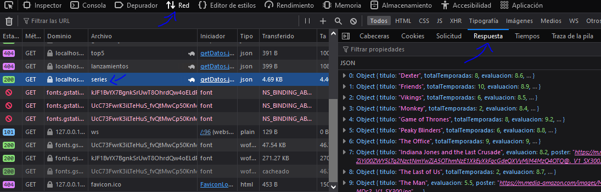

# ScreenMatch

Proyecto desarrollado durante el segundo curso de la formación Avanzando con Java de Alura

## 🔨 Objetivos del proyecto

* 

----------------------------------------------------------------

### Progreso del curso by sanchezluys parte 2: con srping web

| Clase | Descripción                             | Estado                                                                                                           |
|-------|-----------------------------------------|------------------------------------------------------------------------------------------------------------------|
| 01-04 | Utilizando Spring web                   |                                                                                                                  |
|       | incializando la rama del nuevo proyecto |                                                                                                                  |
|       |                                         |                                                                                                                  |
|       |                                         |                                                                                                                  |
                                                                                                                |       |

### relacion series con episodios:

### JPQL

