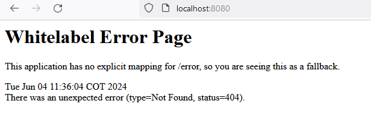

# ScreenMatch - WEB

Proyecto desarrollado durante el segundo curso de la formación Avanzando con Java de Alura

## 🔨 Objetivos del proyecto

* 

----------------------------------------------------------------

### Progreso del curso by sanchezluys parte 2: con srping web

| Clase | Descripción                                                          | Estado                                               |
|-------|----------------------------------------------------------------------|------------------------------------------------------|
| 01-04 | Utilizando Spring web                                                |                                                      |
|       | incializando la rama del nuevo proyecto                              |                                                      |
|       | limpiando las imagenes                                               |                                                      |
|       | Agregando dependencia web                                            |                                                      |
|       | spring-boot-starter-web                                              |                                                      |
|       | se copia la clase screenmatchapplication Consola                     |                                                      |
|       | es necesario no usar la interface commandlinerunner. en la nueva web |                                   |
|       | se limpia el codigo y se verifica si el servidor tomcat se ejecuta   | asi se muestra el servicio tomcat corriendo en error |
|       |                                                                      |                                                      |
                                                                                                                |       |
