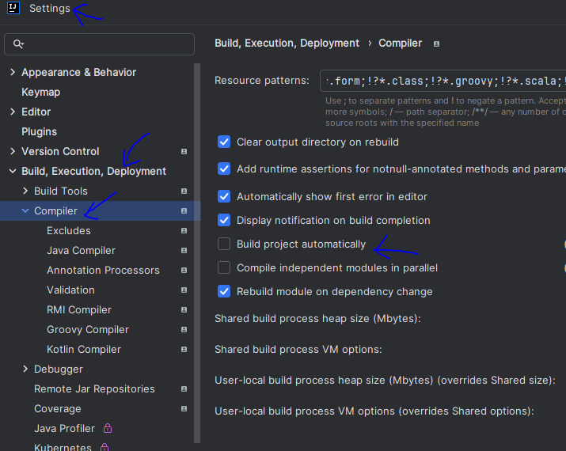

# ScreenMatch - WEB

Proyecto desarrollado durante el segundo curso de la formación Avanzando con Java de Alura

## 🔨 Objetivos del proyecto

* 

----------------------------------------------------------------

### Progreso del curso by sanchezluys parte 2: con srping web

| Clase | Descripción                                                                          | Estado    / Observaciones / Errores                                                                                              |
|-------|--------------------------------------------------------------------------------------|----------------------------------------------------------------------------------------------------------------------------------|
| 01-04 | Utilizando Spring web                                                                |                                                                                                                                  |
|       | incializando la rama del nuevo proyecto                                              |                                                                                                                                  |
|       | limpiando las imagenes                                                               |                                                                                                                                  |
|       | Agregando dependencia web                                                            |                                                                                                                                  |
|       | spring-boot-starter-web                                                              | <artifactId>spring-boot-starter-web</artifactId>                                                                                 |
|       | se copia la clase screenmatchapplication Consola                                     |                                                                                                                                  |
|       | es necesario no usar la interface commandlinerunner. en la nueva web                 |                                                                                                               |
|       | se limpia el codigo y se verifica si el servidor tomcat se ejecuta                   | asi se muestra el servicio tomcat corriendo en error                                                                             |
|       |                                                                                      |                                                                                                                                  |
|       |                                                                                      | Se puede definir el puerto en spring, agregando                                                                                  |
|       |                                                                                      | al application.properties                                                                                                        |
|       |                                                                                      | server.port=8081  por ejemplo.                                                                                                   |
|       |                                                                                      |                                                                                                                                  |
| 01-07 | Mostrando un mensaje en el navegador                                                 |                                                                                                                                  |
|       | MVC + API REST                                                                       |                                                                                                                                  |
|       | - se comenta todo del screenmatch de consola                                         |                                                                                                                                  |
|       | - se crea el nuevo paquete de controller                                             |                                                                                                                                  |
|       | - se crea la nueva clase SerieController                                             |                                                                                                                                  |
|       | -- se agregan las anotaciones en la clase:                                           |                                                                                                                                  |
|       | --- @RestController y @GetMapping                                                    |                                                                                                           |
|       | --- en el controlador podemos enviar un mensaje al sitio web                         |                                                                                                                                  |
|       |                                                                                      |                                                                                                                                  |
| 02-02 | Devolviendo series en el navegador                                                   |                                                                                                                                  |
|       | se arregla el controlador para enviar al front el listado de series                  |                                                                                                                                  |
|       | @Autowired, private SerieRepository repositorio; return repositorio.findAll();       | se presenta un error por referencia circular en jackson databind                                                                 |
|       | DTO:                                                                                 | stackoverflow                                                                                                                    |
|       |                                                                                      | ErrorMvcAutoConfiguration$StaticView : Cannot render error page for request [/series] as the response has already been committed |
| 02-04 | Representando series de la base de datos                                             |                                                                                                                                  |
|       | se crea el paquete dto, cun record SerieDTO, en ese record se agregan                |                                                                                                           |
|       | los datos de la clase Serie que se quieran usar.                                     |                                                                                                                                  |
|       | se usa ahora serieDTO en el controlador de serie                                     |                                                                                                                                  |
|       | se agrega un stream() para crear la lista que cumpla con el dto                      |                                                                                                                                  |
|       | ojo en el stream() los datos deben traerse en orden igual al DTO                     |                                                                                                                                  |
|       | En el sitio web o front se tiene el siguiente error:                                 |                                                                                                                                  |
|       | http://localhost:8080/series. (Razón: Solicitud CORS sin éxito)                      |                                                                                                                                  |
|       |                                                                                      |                                                                                                                                  |
| 02-05 | Mostrando series en la web                                                           |                                                                                                                                  |
|       | Se crea paquete config, y se agrega clase CorsConfiguration                          |                                                                                                                                  |
|       | Se agrega la anotacion @Configuration                                                |                                                                                                                                  |
|       | se activa la interfaz MVC  WebMvcConfigurer                                          |                                                                                                                                  |
|       | se configura addCorsMappings                                                         |                                                                                                                                  |
|       | deberia verse en el front los datos, en red-todos-archivo-ver respuesta              |                                                                                                                                  |
|       | el front corre en el puerto 5500, se configura en el archivo del front               |                                                                                                                                  |
|       |                                                                                      |                                                                                                                                  |
|       | se corrige el codigo de la clase CorsConfiguration                                   |                                                                                                           |
|       | verificar que los puertos coincidan ya que me daba error por los puertos             |                                                                                                                                  |
|       | 8080 ---> 5500                                                                       |                                                                                                                                  |
|       |                                                                                      |                                                                                                                                  |
| 02-07 | Configurando el Live Reload                                                          |                                                                                                                                  |
|       | se agrega la dependencia para spring-boot-devtools                                   |                                                                                                           |
|       | se habilita el auto build                                                            |                                                                                                           |
|       | en avanzadas se activa la compilacion automatica                                     |                                                                                                                                  |
|       |                                                                                      |                                                                                                                                  |
| 03-02 | creando un servicio para séries                                                      |                                                                                                                                  |
|       | se crea nuevo servicio, para buenas practicas y quitarle responsabilidades           |                                                                                                                                  |
|       | al seriecontroller, creando serieservice, con la anotacion @Service                  |                                                                                                                                  |
|       | se lleva el codigo del metodo al serieservice                                        |                                                                                                                                  |
|       | se verifica funcionamiento con postman                                               |                                                                                                           |
|       |                                                                                      |                                                                                                                                  |
| 03-05 | Mostrando el top 5 de series de nuestra base de datos                                |                                                                                                                                  |
|       | se crean las otras rutas en el seriecontroller                                       |                                                                                                                                  |
|       | /series/top5 con el metodo obtenerTop5()                                             |                                                                                                                                  |
|       | - usando un metodo que ya estaba definido: findTop5ByOrderByEvaluacionDesc()         |                                                                                                                                  |
|       | - para mejorar el codigo se crea un metodo convierteDatos()                          |                                                                                                                                  |
|       | se verifica con postman                                                              |                                                                                                           |
|       |                                                                                      |                                                                                                           |
| 03-07 | Exhibiendo las series más recientes                                                  |                                                                                                                                  |
|       | usando jpql, es mas seguro y eficiente                                               |                                                                                                                                  |
|       | da error en el dialecto, revisando con IA tabnine recomienda usar:                   |                                                                                                                                  |
|       | hibernate.dialect=org.hibernate.dialect.PostgreSQLDialect                            |                                                                                                                                  |
|       | se actualiza y ahora si funciona.                                                    |                                                                                                                                  |
|       | - se va a serieservice                                                               |                                                                                                                                  |
|       | - para crearel metodo   obtenerLanzamientosMasRecientes()                            |                                                                                                                                  |
|       | luego vamos al controlador                                                           |                                                                                                                                  |
|       | - usamos @RequestMapping("/series") para ese endpoint que se repite                  |                                                                                                                                  |
|       | - se crea la ruta lanzamientos                                                       |                                                                                                                                  |
|       | - se verifica sitio web corriendo                                                    |                                                                                                                                  |
|       |                                                                                      |                                                                                                                                  |
| 03-08 | Devolviendo los detalles de la serie                                                 |                                                                                                                                  |
|       | en seriecontroler, para mapear las url ahora dinamicas                               |                                                                                                                                  |
|       | @GetMapping("/{id}")                                                                 |                                                                                                                                  |
|       | se agrega @PathVariable Long id                                                      | verifiar dependenci, en mi caso decia que dependia de maven y me daba error                                                      |
|       | da un error:                                                                         |                                                                                                                                  |
|       | Failed to convert value of type 'java.lang.String' to required type 'java.lang.Long' |                                                                                                                                  |
|       | ya que faltaba deifinir el id en serieDTO                                            |                                                                                                                                  |
|       |                                                                                      |                                                                                                                                  |
| 04-02 | Mostrando todos los episodios                                                        |                                                                                                           |
|       | se agrega en el controller @GetMapping("/{id}/temporadas/todas")                     |                                                                                                                                  |
|       | se crea la clase record EpisodioDTO                                                  |                                                                                                                                  |
|       | se usa optional y stream(), ya muestra todas las temporadas pero no una a una        |                                                                                                                                  |
|       |                                                                                      |                                                                                                                                  |
| 04-03 | Mostrando los episodios por temporada                                                |                                                                                                                                  |
|       | ctrl+alt+l indentacion automatica en intellij                                        |                                                                                                                                  |
|       | se crea la logica para los episodios por temporada por numero                        |                                                                                                                                  |
|       | se usa stream y jpql                                                                 |                                                                                                                                  |
|       |                                                                                      |                                                                                                                                  |

